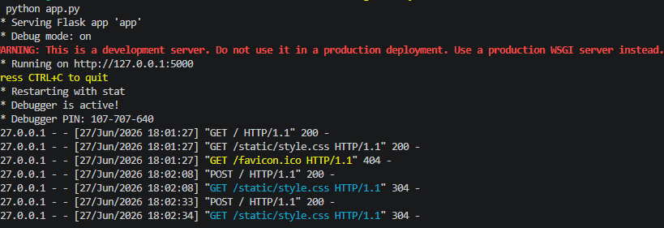
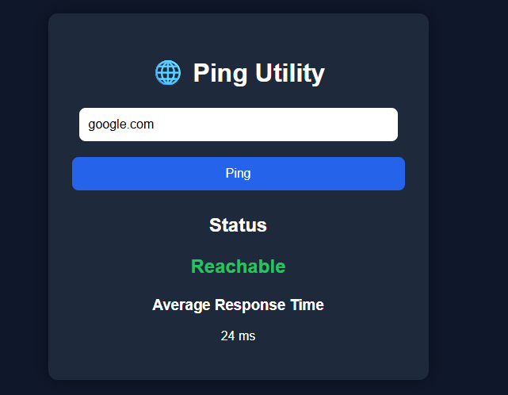
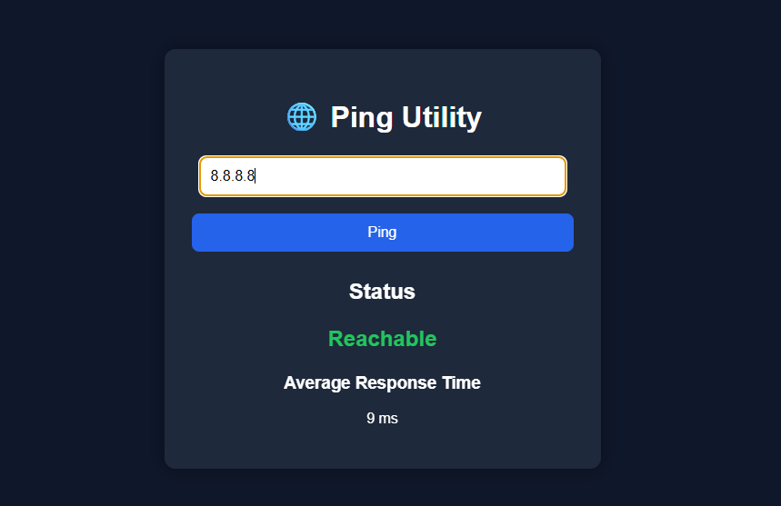

# 🌐 Ping Utility

A simple web-based **Ping Utility** built with **Python (Flask), HTML, and CSS**. This application allows users to check whether a domain or IP address is reachable and displays the average response time.

---

## 📸 Screenshots

### Home Page



### Ping Result - Reachable



### Ping Result - Unreachable



---

## ✨ Features

* 🌐 Ping any domain name or IP address
* ⚡ Displays host reachability
* ⏱ Shows average response time
* 💻 Simple and clean web interface
* 🖥 Works on Windows, Linux, and macOS
* 🚀 Built using Flask

---

## 🛠 Technologies Used

* Python
* Flask
* HTML5
* CSS3

---

## 📂 Project Structure

```text
Ping-Utility/
│
├── app.py
├── requirements.txt
├── README.md
│
├── templates/
│   └── index.html
│
├── static/
│   └── style.css
│
└── images/
    ├── img1.png
    ├── img2.png
    └── img3.png
```

---

## ⚙ Installation

Clone the repository:

```bash
git clone https://github.com/yourusername/Ping-Utility.git
```

Move into the project folder:

```bash
cd Ping-Utility
```

Install dependencies:

```bash
pip install -r requirements.txt
```

Run the application:

```bash
python app.py
```

Open your browser and visit:

```text
http://127.0.0.1:5000
```

---

## 🚀 Usage

1. Enter a domain name or IP address.
2. Click the **Ping** button.
3. View the connection status and average response time.

Example inputs:

* google.com
* github.com
* 8.8.8.8
* 1.1.1.1

---

## 📌 Future Improvements

* Ping history
* Packet loss statistics
* TTL information
* Download results as TXT
* Dark/Light mode
* Loading animation
* Responsive design

---

## 📄 License

This project is open source and available under the MIT License.
